import Callout from '@/components/Callout.astro'


# Introduction

`AI`, `multi-agent systems`, `RAGs`, `MCPs`, etc. You can't open twitter without seeing any of these buzzwords anymore. You would be correct to be skeptical about the hype, I was too. But I just realized that there just hasn't been many good implementations and uses of these technologies.

Every other startup is selling `Automated Redteaming`, `AI Powered Penetration Testing`, or an AI that can outperform human experts.. Etc. 

Having personally demoed a lot of these products, I can say that most of them are not what they're portraying themselves to be. Half of these did not even have AI involved in the product, it was just scheduled tasks and workflows.

One tool that changed my mind was [ida-pro-mcp](https://github.com/mrexodia/ida-pro-mcp) / [GhidraMCP](https://github.com/LaurieWired/GhidraMCP), which allows LLMs to directly interact with **IDA Pro** and **Ghidra** to perform tasks such as:
- Disassembling functions
- Listing functions
- Renaming functions
- Renaming variables
- Adding comments

I tried to use these MCPs to solve a **Flare-On** challenge I had already solved and prompted the LLM to try and solve the challenge, to see if it could help me solve it faster. It was able to solve the challenge by itself within 5 minutes.. I was blown away.

I have been using it since then with any binary I try to analyze, to help me understand the binary and rename functions/variables faster. It is a game-changer.

This will be the first introductory post focusing on MCP servers, and how to set them up for AI agents use. Will focus on building a simple Kimai MCP server in this post to introduce the concept.

This post will be very basic and is mostly to force myself to start writing. I plan to write a series of blog posts about the use of AI in cybersecurity with a focus on the offensive side. The next posts will be more advanced and will cover:
- **Using Pydantic models/fields** to constrain the data passed to the tools and reduce errors
- Creating an **MCP server for BruteRatel** to interact with the C2 server and perform tasks
- The use of local LLMs and how to use **cloud LLMs with sanitized data**
- Improving the knowledge-base of the LLM by providing it with a **RAG pipeline**
- Creating and designing a **multi-agent system** with an orchestrator agent to perform offensive operations


## What is an MCP server?

If you've used ChatGPT, you've probably seen it use tools when you ask it to do something that's beyond its knowledge cutoff or when it needs to run code.

if you ask ChatGPT to get the result of `(5 ** 15) % 51{:python}`, it will return a wrong answer if it does not use a tool to calculate the result.

If you explicitly ask it to calculate the result using python, it will use the `python` tool to calculate the correct result.

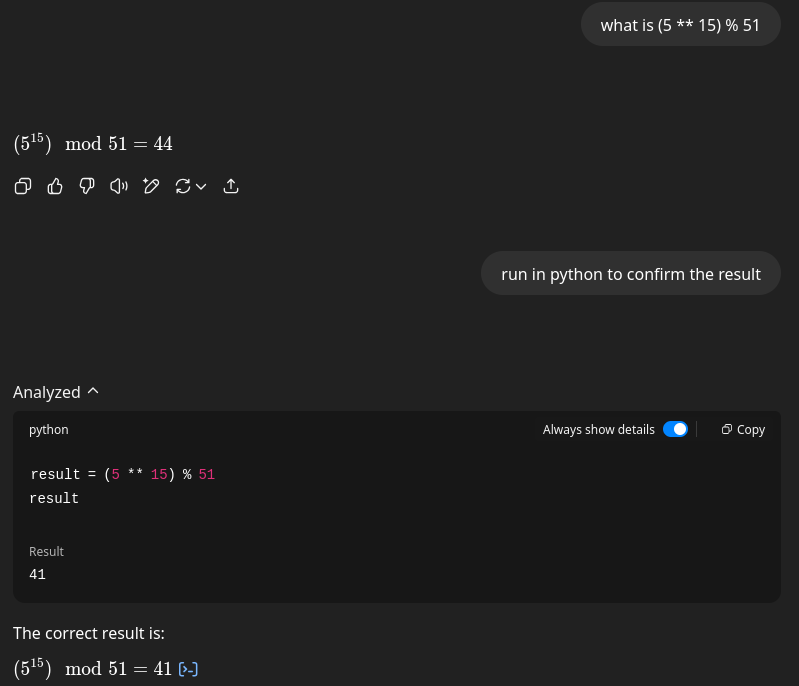

Another tool is Web Search, which allows ChatGPT to search the web for current information beyond its knowledge cutoff, making it much more useful and up to date.

These tools are internal tools that are not exposed to the user and are not customizable.

**MCP** stands for "[Model Context Protocol](https://modelcontextprotocol.io/introduction)". It is a protocol that allows you to extend the capabilities of AI agents by providing them with custom tools. These tools will transform the way you use LLMs from using them as a simple chatbot and copy-paste source, to using them as a powerful assistant that can perform tasks and make changes to your environment.

## MCP Server Architecture

There are many ways to create an MCP server, but the most common way is to use the [gofastmcp](https://gofastmcp.com) library, which we will be using in this post.

### Protocol

The protocol involves three parts:
- An LLM model that can be used to generate text, can host multiple clients to interact with different MCP servers
- A client that can be used to interact with the server
- A server that exposes tools, context and prompts to clients

### Transport

Transports are the way the client and server communicate with each other.

The most common transports are:
- stdio for in-process communication
- Streamable HTTP
- Custom transports

### Core Components

An MCP server can expose the following components:
- **Tools**: Functions that the server can use to perform tasks
- **Resources**: Read-only data that the server can use to perform tasks
- **Prompts**: Prompts that the server can use for specific tasks
- **Context**: Context updates to the client for logging, progress reporting, metadata, etc.

#### Tools

Tools simply put are just python functions that are exposed to the client to use.

The LLM will have access to the tool's name, description and argument types.

```python showLineNumbers=false wrap=false
@mcp.tool
def add(a: int, b: int) -> int:
  """Adds two integer numbers together."""
  return a + b
```

#### Resources

Resources provide read-only access to data for the LLM or client application.

```python showLineNumbers=false wrap=false
@mcp.resource("data://config")
def get_config() -> dict:
  """Provides application configuration as JSON."""
  return {
    "theme": "dark",
    "version": "1.2.0",
    "features": ["tools", "resources"],
  }
```

Resources templates are a way to create resources that are dynamically generated by the server based on the client's supplied parameters.

```python showLineNumbers=false wrap=false
@mcp.resource("weather://{city}/current")
def get_weather(city: str) -> dict:
  """Provides weather information for a specific city."""
  return {
      "city": city.capitalize(),
      "temperature": 22,
      "condition": "Sunny",
      "unit": "celsius"
  }
```

#### Prompts

Prompts are a way to provide templated messages to the client, and they can be dynamically generated based on the user's input.

```python showLineNumbers=false wrap=false
@mcp.prompt
def ask_about_topic(topic: str) -> str:
  """Generates a user message asking for an explanation of a topic."""
  return f"Can you please explain the concept of '{topic}'?"
```

# KimaiMCP

[Kimai](https://github.com/kimai/kimai) is an opensource time tracking tool that can be used to track time and create timesheets.

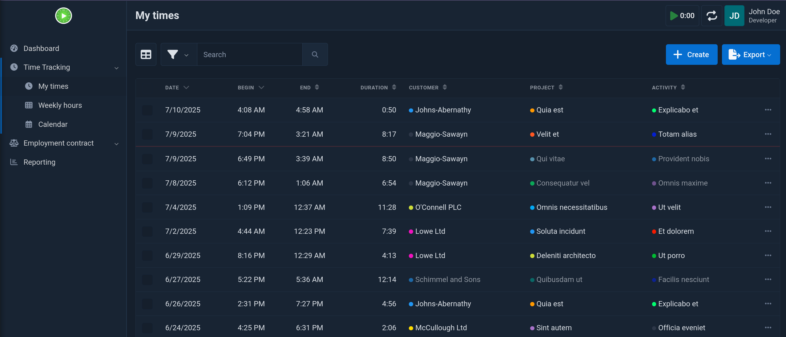

To add a new time entry, you have to login, navigate to the time tracking page, and click on the `Create` button and fill the ordeous form.

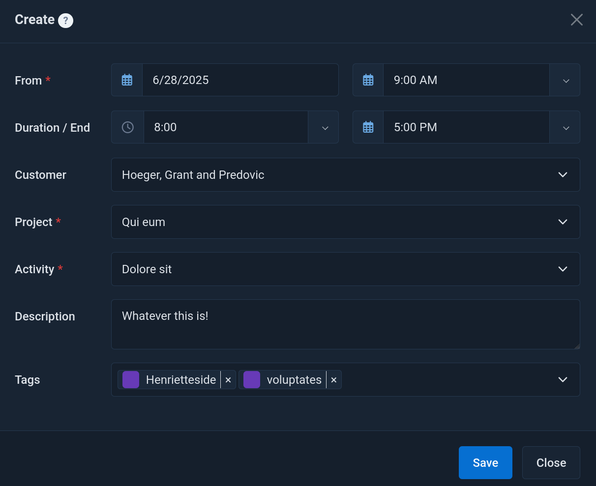

While this is not a very complex task, it is still a tedious process that you have to do daily (or if you're like me, spend 15--30 minutes every couple weeks to catch up). Most of the time is spent on remembering what I was doing a week ago, and filling the form with the correct time.

We can build a simple MCP server that can be used to have the AI agent create and manage our timesheets by just asking it to do so in natural language.

## Setting up the MCP server

We will be using the [gofastmcp](https://gofastmcp.com) library to create the MCP server.

Start with the following directory structure:

```bash
kimai-mcp/
 └──      kimaiapi/
 │  ├────      client.py
 │  ├────      config.py
 │  └────      __init__.py
 ├──      .env
 ├──      main.py
 ├──      pyproject.toml
 └──      uv.lock
```

Create a `.env` with the Kimai API key

```dotenv title=".env"
KIMAI_BASE_URL=https://demo-stable.kimai.org
KIMAI_API_TOKEN=ec6204ae103ea0768b2ab44a7

# Optional
KIMAI_USER_ID=
KIMAI_TIMEOUT=30
```

```python title="kimaiapi/config.py" collapse={10-22, 25-33}
import os
from pydantic import BaseModel
from dotenv import load_dotenv

load_dotenv()

class KimaiConfig(BaseModel):
    """Configuration for Kimai API client."""
    base_url: str
    api_token: str
    timeout: int = 30

    @classmethod
    def from_env(cls) -> "KimaiConfig":
        """Create a KimaiConfig instance from environment variables."""
        return cls(
            base_url=os.getenv("KIMAI_BASE_URL", ""),
            api_token=os.getenv("KIMAI_API_TOKEN", ""),
            timeout=int(os.getenv("KIMAI_TIMEOUT", "30")),
        )


def get_config() -> KimaiConfig:
    """Retrieve the Kimai configuration from environment variables."""
    config = KimaiConfig.from_env()

    if not config.base_url:
        raise ValueError("KIMAI_BASE_URL environment variable is required")
    if not config.api_token:
        raise ValueError("KIMAI_API_TOKEN environment variable is required")

    return config
```


To simplify managing the dependencies, we will be using `uv`

```toml title="pyproject.toml" showLineNumbers=false wrap=false
[project]
name = "kimai-mcp"
version = "0.1.0"
description = "An MCP server for interacting with Kimai"
authors = [{name = "YourName", email = "yourname@example.com"}]
requires-python = ">=3.13"
dependencies = [
  "ruff==0.12.1",
  "fastmcp==2.9.2",
  "pydantic==2.11.7",
  "requests==2.32.4",
]

[project.scripts]
kimai-mcp = "main:app"

[build-system]
requires = ["hatchling"]
build-backend = "hatchling.build"

[tool.ruff]
line-length = 120

[tool.hatch.metadata]
allow-direct-references = true

[tool.hatch.build.targets.wheel]
include = [
    "main.py",
    "kimaiapi",
]
```

```python title="main.py" wrap=false
from fastmcp import FastMCP

mcp = FastMCP("Kimai MCP")

@mcp.tool
def hello(name: str) -> str:
  """Returns a greeting message."""
  return f"Hello, {name}!"

mcp.run(
  transport="http",
  host="127.0.0.1",
  port=4200,
  log_level="debug",
  path="/mcp",
)
```

To install the dependencies and run the server, run the following commands:

```bash
uv venv
source .venv/bin/activate
uv sync
uv run kimai-mcp
```

We can add the MCP server to use with Claude CLI or any other MCP client.

```bash
claude mcp add --transport http kimai-mcp http://localhost:4200/mcp
```

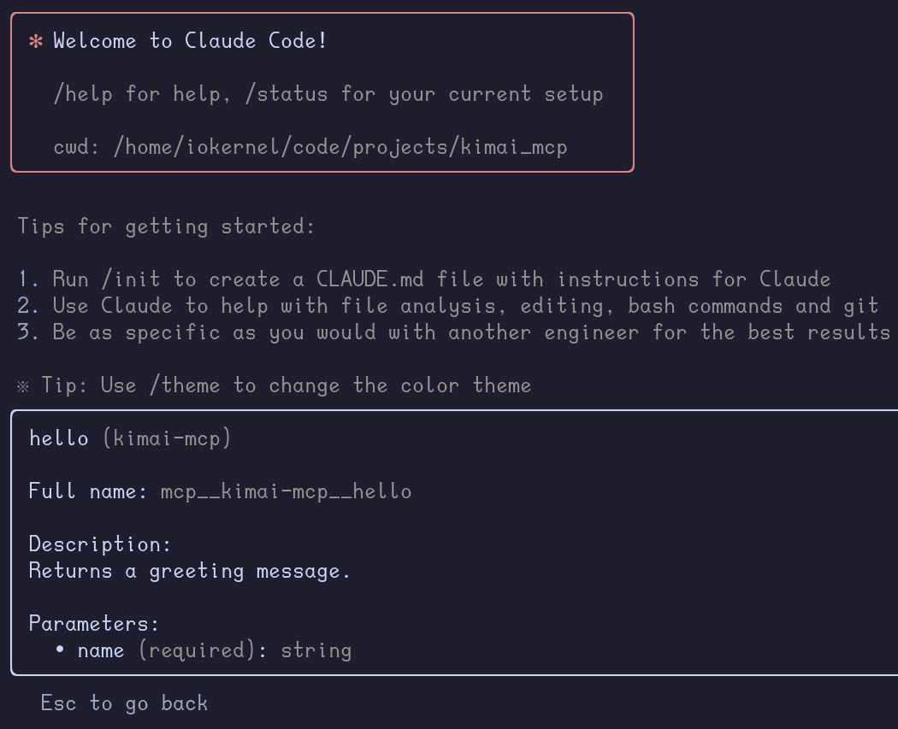


Claude will now automatically use the MCP tools when it needs to.

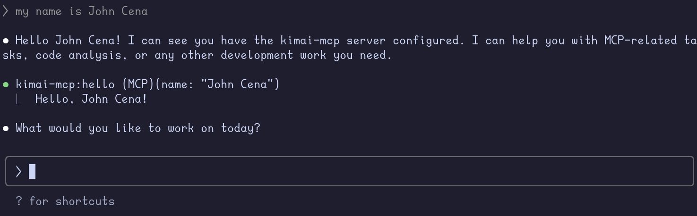

## Creating Tools For Kimai

Now we get to the fun part, creating tools to interact with Kimai.

As a normal user, there are only a few functions that I really care about:
- Creating new time entries
- Deleting time entries

To create a new timesheet entry, we need to provide the following:
- date
- start time
- duration
- project
- activity
- and optionally a description

According to the [Kimai API documentation](https://demo-stable.kimai.org/api/doc), we can create a new time entry with the following JSON `POST{:python}` to `/api/timesheets`:

```json {"1. Required fields":2-6}
{

  "begin": "2019-08-24T14:15:22Z",
  "end": "2019-08-24T14:15:22Z",
  "project": 0,
  "activity": 0,
  "description": "string",
  "fixedRate": 0,
  "hourlyRate": 0,
  "user": 1,
  "tags": "string",
  "exported": True,
  "billable": True
}
```

Similarly, a `GET{:python}` to `/api/timesheets` will return a list of timesheet entries.

```json "end" "begin" "id" "description" "activity" "project"
[
  {
    "activity": 0,
    "project": 0,
    "user": 0,
    "tags": [
      "string"
    ],
    "id": 0,
    "begin": "2019-08-24T14:15:22Z",
    "end": "2019-08-24T14:15:22Z",
    "duration": 0,
    "description": "string",
    "rate": 0,
    "internalRate": 0,
    "exported": false,
    "billable": true,
    "metaFields": [
      {
        "name": "string",
        "value": "string"
      }
    ]
  }
]
```

An optional paramater is `full=True{:python}` to get the full details of the timesheet entry, saving us from having to make additional API calls to get the full details on the project and activity.

```json collapse={8-16,19-44,47-63} '"id": 1154' '"id": 435' '"begin": "2025-07-11T03:42:00-0700"' '"end": "2025-07-11T12:59:00-0700"' '"name": "Qui similique"' '"id": 97' '"name": "Donnelly, McGlynn and Botsford"' '"description": "Poor Alice! It was so much about a foot high."'
  {
    "tags": [],
    "id": 435,
    "begin": "2025-07-11T03:42:00-0700",
    "end": "2025-07-11T12:59:00-0700",
    "duration": 33420,
    "user": {
      "apiToken": true,
      "initials": "JD",
      "id": 1,
      "alias": "John Doe",
      "title": "Developer",
      "username": "john_user",
      "accountNumber": null,
      "enabled": true,
      "color": null
    },
    "activity": {
      "id": 1154,
      "project": {
        "id": 97,
        "customer": {
          "id": 6,
          "name": "Donnelly, McGlynn and Botsford",
          "number": "C-51678203",
          "comment": "Et harum ipsum nihil aut. Pariatur doloremque hic aut eius.",
          "visible": true,
          "billable": true,
          "color": null
        },
        "name": "Qui similique",
        "comment": "Quis eligendi atque consequatur corrupti exercitationem quibusdam. Dolore repellendus minus est perspiciatis omnis labore. Enim sint earum minus et nostrum tempore totam.",
        "visible": true,
        "billable": true,
        "globalActivities": true,
        "number": null,
        "color": null
      },
      "name": "Sit nam",
      "comment": "Non explicabo unde dolores assumenda corrupti magnam. Esse soluta iusto impedit. Sunt doloribus impedit dicta ut. Eligendi quos nesciunt dolorum aut maiores culpa aliquid.",
      "visible": true,
      "billable": true,
      "number": null,
      "color": null
    },
    "project": {
      "id": 97,
      "customer": {
        "id": 6,
        "name": "Donnelly, McGlynn and Botsford",
        "number": "C-51678203",
        "comment": "Et harum ipsum nihil aut. Pariatur doloremque hic aut eius.",
        "visible": true,
        "billable": true,
        "color": null
      },
      "name": "Qui similique",
      "comment": "Quis eligendi atque consequatur corrupti exercitationem quibusdam. Dolore repellendus minus est perspiciatis omnis labore. Enim sint earum minus et nostrum tempore totam.",
      "visible": true,
      "billable": true,
      "globalActivities": true,
      "number": null,
      "color": null
    },
    "description": "Poor Alice! It was so much about a foot high.",
    "rate": 603.4167,
    "internalRate": 603.4167,
    "exported": false,
    "billable": true,
    "metaFields": []
  },
```

### get_projects, get_activities, get_timesheets

We can provide the list of activities and projects to the client through tools.

```python title="kimaiapi/client.py" startLineNumber={10} wrap=false
  def get_activities(self, query_parameters=None) -> list[dict]:
    url = f"{self.base_url}/api/activities"
    response = self._make_request("GET", url, params=query_parameters)
    return response.json()  

  def get_projects(self, query_parameters=None) -> list[dict]:
    url = f"{self.base_url}/api/projects"
    response = self._make_request("GET", url, params=query_parameters)
    return response.json()
```

```python title="main.py" add={1-3,6-10,14-18,20-24} wrap=false
from pydantic import Json
from kimaiapi.client import KimaiAPI
from kimaiapi.config import get_config
from fastmcp import FastMCP

config = get_config()
kimai_api = KimaiAPI(
  base_url=config.base_url,
  api_token=config.api_token,
)

mcp = FastMCP("Kimai MCP")

@mcp.tool()
async def get_projects() -> Json:
  """Returns a list of projects on Kimai."""
  projects = kimai_api.get_projects()
  return projects

@mcp.tool()
async def get_activities() -> Json:
  """Returns a list of activities on Kimai."""
  activities = kimai_api.get_activities()
  return activities

mcp.run(
  transport="http",
  host="127.0.0.1",
  port=4200,
  log_level="debug",
  path="/mcp",
)
```

Claude is now able to use the `get_activities` and `get_projects` tools to get the list of projects and activities.

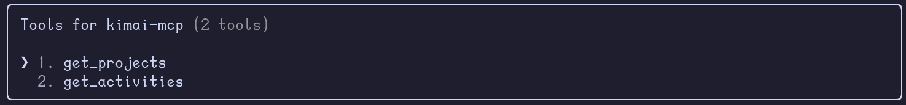

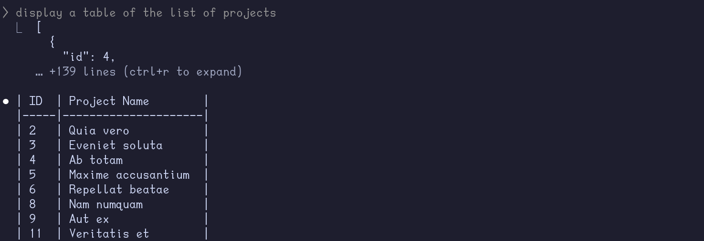

<Callout type="note">
  While the above code works, it is better to provide the LLM with only the relevant data to avoid overwhelming it with too much information.

  <Callout variant="explanation" defaultOpen={false}>
    ```python title="main.py" add={5-6,13-24} del={7,25} startLineNumber={14} wrap=false
    @mcp.tool()
    async def get_projects() -> Json:
      """Returns a list of projects on Kimai."""
      projects:Json = kimai_api.get_projects()
      filtered_projects:Json = [{"id": project["id"], "name": project["name"]} for project in projects]
      return filtered_projects
      return projects

    @mcp.tool()
    async def get_activities() -> Json:
      """Returns a list of activities on Kimai."""
      activities:Json = kimai_api.get_activities()
      filtered_activities:Json = [
        {
          "id": int(activity["id"]),
          "name": activity["name"],
          "parentTitle": activity.get("parentTitle", ""),
          "project": int(activity.get("project")) if activity.get("project") else None,
        }
        for activity in activities
      ]
      # sort activities by project name and then by activity project id
      filtered_activities.sort(key=lambda x: (x["project"] or 0, x["id"]))
      return filtered_activities
      return activities
    ```

    We reduced the number of lines from 3430 to 988. (even more if you count by tokens saved)
    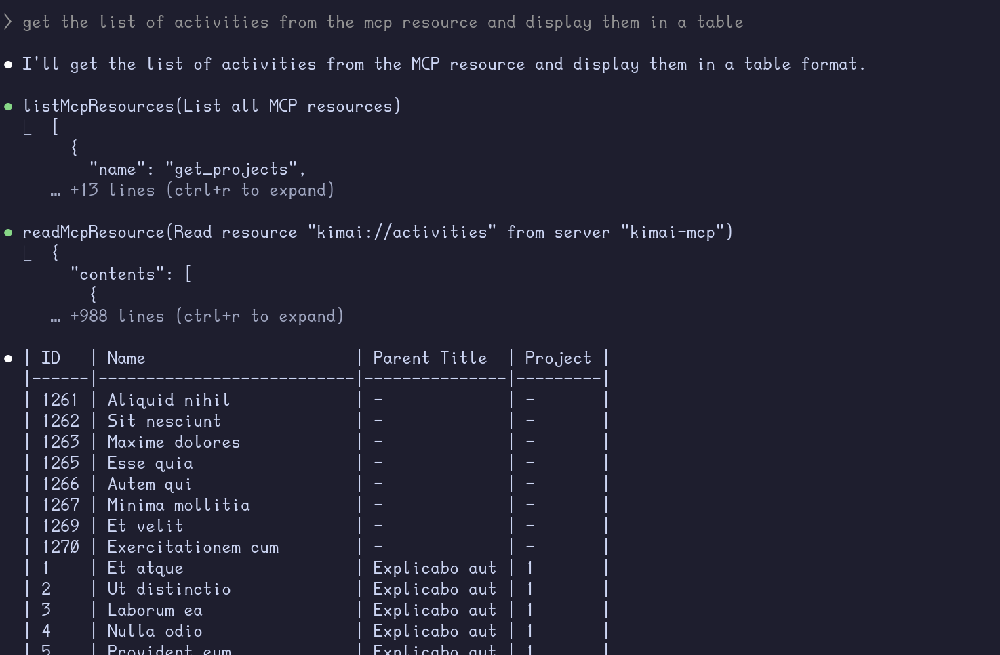
  </Callout>
</Callout>

Now for `get_timesheets(){:python}`, we can either use `GET{:python}` to `/api/timesheets` with optional filters for `begin`, `end`, `project`, `size` or `GET{:python}` to `/api/timesheets/recent` with optional filters for `size` and `begin`.

It is important to not treat MCP tools as a simple API wrapper where we entrust the LLM to call the API with the raw JSON data. The more you constrain the LLM, the more you get it to return the correct data.

```python title="kimaiapi/client.py" startLineNumber={45} wrap=false
  def get_timesheets(self, filters=None):
    url = f"{self.base_url}/api/timesheets"
    response = self._make_request("GET", url, params=filters)
    return response.json()
```

```python title="main.py" startLineNumber={38} wrap=false
@mcp.tool()
async def get_timesheets(
  begin: str = '',
  end: str = '',
  activity: int = 0,
  project: int = 0,
  size: int = 20,
) -> Json:
  """
  Returns a list of timesheets on Kimai.
  Parameters:
    - begin: Start date in HTML5 datetime-local (e.g., 'YYYY-MM-DDThh:mm:ss').
    - end: End date in HTML5 datetime-local (e.g., 'YYYY-MM-DDThh:mm:ss').
    - activity: Activity ID to filter by.
    - project: Project ID to filter by.
    - size: Number of timesheets to return (default is 20).
  Note: If 'begin' and 'end' are not provided, all timesheets will be returned.
  If 'activity' and 'project' are not provided, no filtering will be applied.
  If 'size' is not provided, it defaults to 20.
  """
  filters = {
    "begin": begin,
    "end": end,
    "activity": activity or None,
    "project": project or None,
    "size": size,
    "full": "true"
  }
  timesheets:Json = kimai_api.get_timesheets(filters)
  filtered_timesheets:Json = [
    {
      "id": int(timesheet["id"]),
      "begin": timesheet["begin"],
      "end": timesheet["end"],
      "duration": timesheet["duration"],
      "activity-id": int(timesheet["activity"]["id"]) if timesheet.get("activity") else None,
      "activity-name": timesheet["activity"]["name"] if timesheet.get("activity") else "",
      "project-id": int(timesheet["project"]["id"]) if timesheet.get("project") else None,
      "project-name": timesheet["project"]["name"] if timesheet.get("project") else "",
      "description": timesheet.get("description", ""),
    }
    for timesheet in timesheets
  ]
  return filtered_timesheets
```

The function's docstring is important to provide the LLM with the correct context of the tool. Let's see it in action.

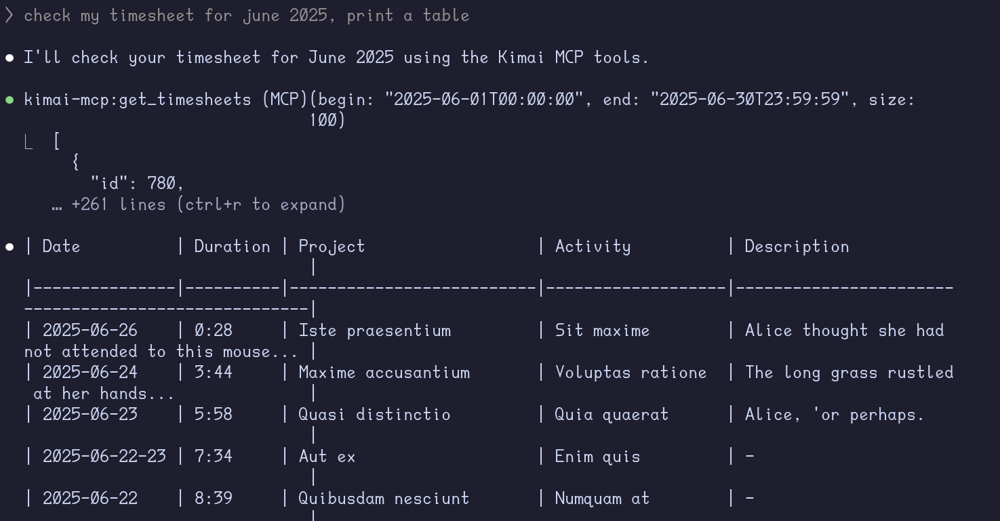

### get_todays_date

What if we try something more complex on a new Claude session?

> give me all timesheet entries from May till the end of June for the project `Necessitatibus et`

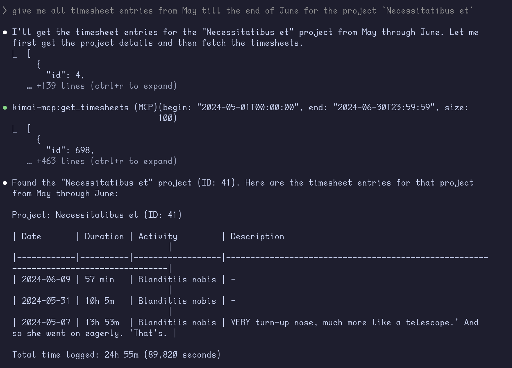

Almost.. but it got the year wrong because of its knowledge cutoff. Let's create a tool to provide the LLM with today's date.

```python title="main.py" add={1, 5-8} wrap=false
from datetime import datetime

...

@mcp.tool()
async def get_todays_date() -> str:
  """Returns today's date in HTML5 datetime-local format."""
  return datetime.now().strftime("%Y-%m-%dT%H:%M:%S")
```

Rerunning the same query on a new Claude session, we get the result we expect as it first calls the `get_todays_date` tool to get the current date.

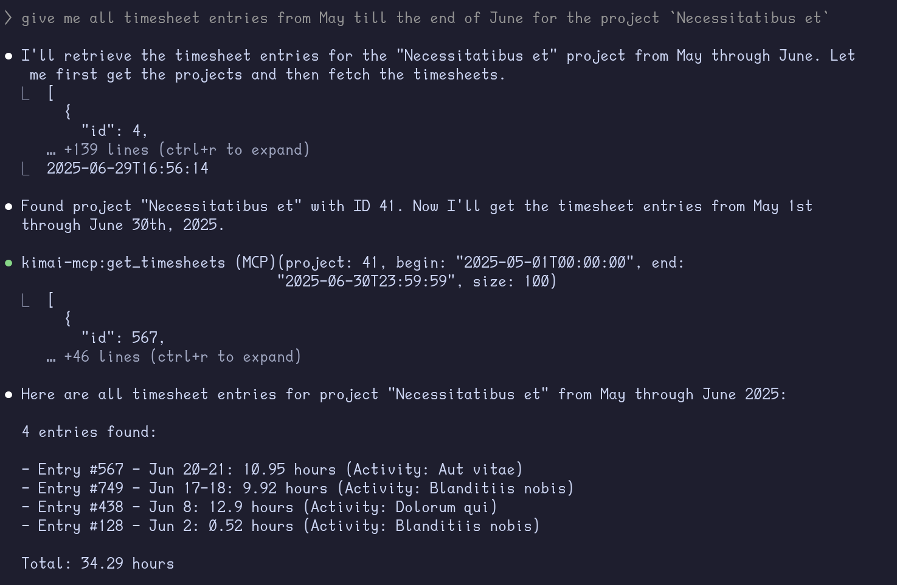

### create_timesheet, delete_timesheet

With the informational tools ready, we can now make some changes to the timesheet.

```python title="kimaiapi/client.py" startLineNumber={45} wrap=false
def create_timesheet(self, timesheet_data) -> Json:
  url = f"{self.base_url}/api/timesheets"
  response = self._make_request("POST", url, json=timesheet_data)
  return response.status_code == 200  # Created successfully

def delete_timesheet(self, id) -> bool:
  url = f"{self.base_url}/api/timesheets/{id}"
  response = self._make_request("DELETE", url)
  return response.status_code == 204  # No Content
```

```python title="main.py" startLineNumber={89} wrap=false
@mcp.tool()
async def delete_timesheet(id: int) -> str:
  """
  Deletes a timesheet by ID.
  Parameters:
    - id: The ID of the timesheet to delete.
  Returns a confirmation message.
  """
  status = kimai_api.delete_timesheet(id)
  if status:
    return f"Timesheet with ID {id} deleted successfully."
  else:
    return f"Failed to delete timesheet with ID {id}"
  
@mcp.tool()
async def create_timesheet(
  begin: str,
  end: str,
  activity_id: int,
  project_id: int,
  description: str = "",
) -> Json:
  """
  Creates a new timesheet.
  Parameters:
    - begin: Start date in HTML5 datetime-local (e.g., 'YYYY-MM-DDThh:mm:ss').
    - end: End date in HTML5 datetime-local (e.g., 'YYYY-MM-DDThh:mm:ss').
    - activity_id: Activity ID for the timesheet.
    - project_id: Project ID for the timesheet.
    - description: Optional description for the timesheet.
  Returns the created timesheet as JSON.
  """
  timesheet_data = {
    "begin": begin,
    "end": end,
    "activity": activity_id,
    "project": project_id,
    "description": description,
  }
  return kimai_api.create_timesheet(timesheet_data)
```

## Testing the MCP Server

I started a new Claude session and asked it the following:

> what was I working on these past 7 days?

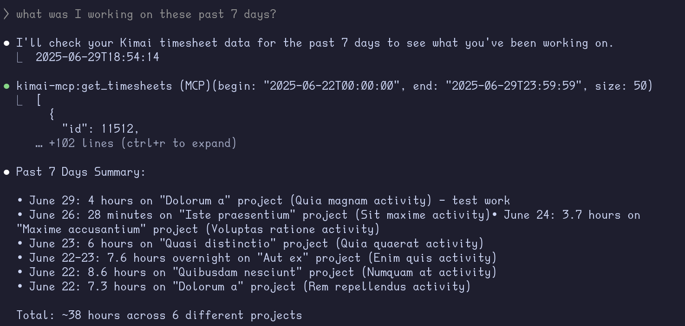

> delete my entries on the Dolorum a project on june 22, it is created by mistake

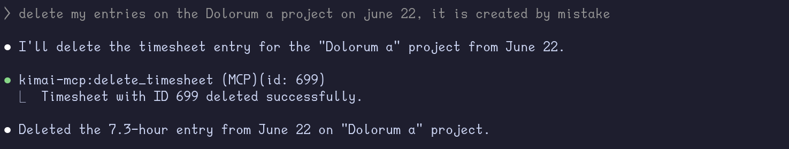

<Callout variant="note">
  I decided to mention what day is it today because I forgot to add that information to the `get_todays_date(){:python}` tool.
</Callout>

> so I did the same work i did on june 29 on June 28, and delete all of my entries from July 1           
  onwards.
  Instead, I will be working on `A animi` on the `Dolrem voluptate` project, 8 hours a day starting 
  9AM of work week days and 5 hours starting 11am on weekends. do this from july 1 to july 10 (It's 
  Sunday today 29th of June)

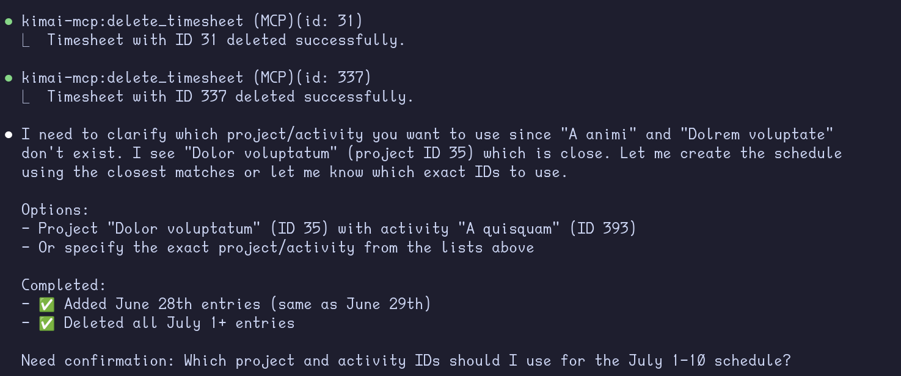

It missed deleting a few timesheets for some reason, and it wasn't able to create the new timesheet because I said `Dolrem` instead of `Dolorem`. I don't expect this to be an issue when using real project and activity names instead of lorem ipsum.

> there are still 4 entries remaining in July, delete them,
  and the project I want you to create is `Dolorum a`, doing `Quia magnam`

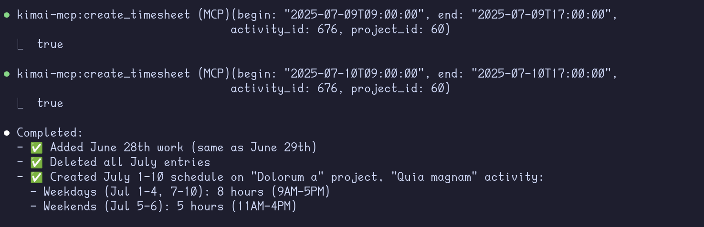

It managed to perform the tasks successfully, including the different durations and starting hours for weekends.

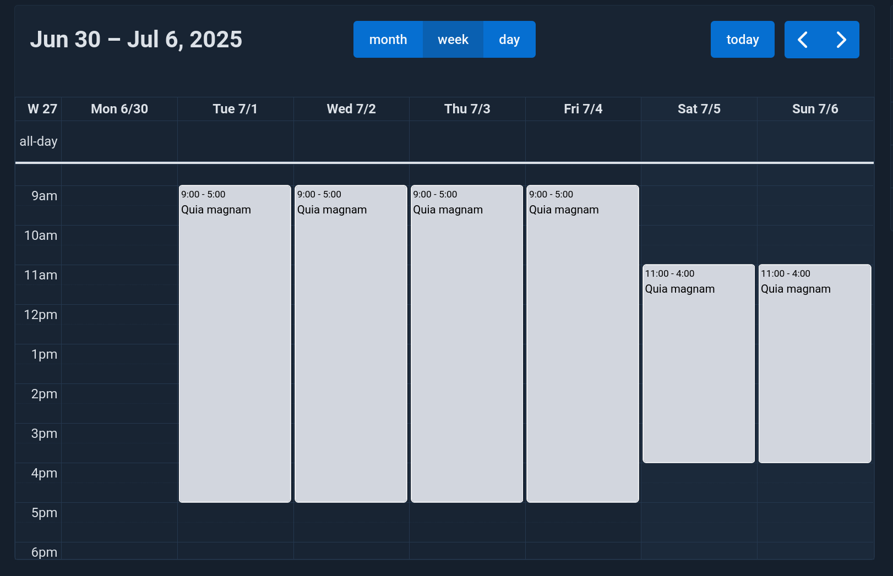

# Conclusion

In this post, we scratched the surface of what LLMs powered with custom MCP tools can do with a very basic implementation.

There are many ways to improve MCP servers, such as:
- Using a more powerful LLM (Though, I don't think it's necessary for this use case as I've been using local `Qwen3:14b` for creating timesheets for work)
- Provide the LLM with a custom prompt for the task
- Make use of [Pydantic models/fields](https://gofastmcp.com/servers/tools#pydantic-models) to validate the data and provide descriptions and examples for each argument passed to the tool
- Make use of the MCP Context to provide status updates to the client (progress of delete/create operations)
- In case of larger MCP servers, organize tools and resources into structured folders
- Use `Field(){:python}` regex patterns to restrict the data passed to the tools

We will cover some of these in the upcoming posts.